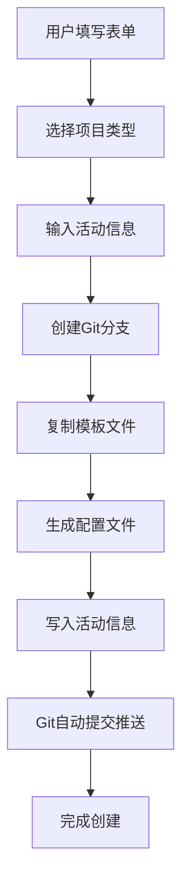
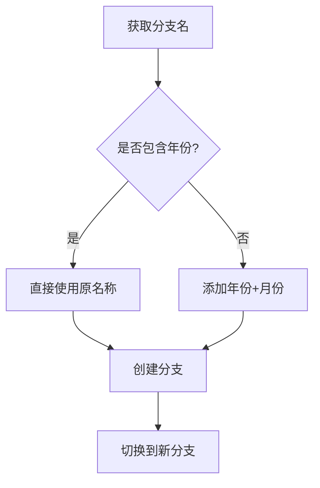
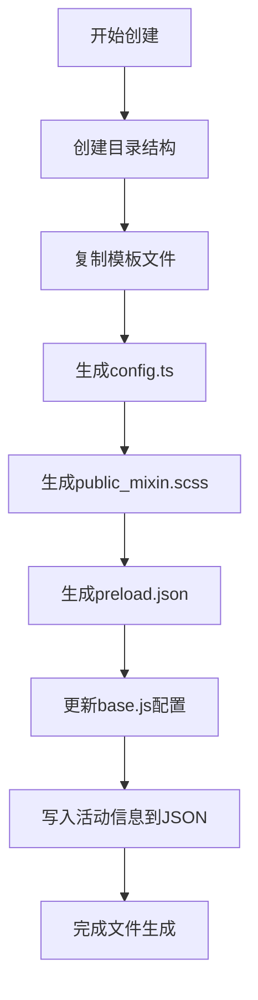

# 活动页面自动化创建工具

## 概述

`create_page` 是一个全自动化的活动页面创建工具，支持快速生成 Yoho、Hiyoo、SoulStar 等项目的活动页面，并自动处理 Git 分支管理、配置文件生成、资源部署等流程。

## 功能特性

### 🚀 核心功能
- **多项目支持**：Yoho、Hiyoo、SoulStar 项目
- **智能分支管理**：自动检测年份，智能命名分支
- **配置文件生成**：自动生成活动配置、样式文件、预加载配置
- **Git 自动化**：自动提交、推送代码
- **模板系统**：支持多种活动模板（普通活动、运营活动、热门活动）

### 🎯 智能分支命名
- 如果分支名包含年份（20-99），直接使用原名称
- 如果分支名不包含年份，自动添加当前年份和月份
- 示例：`master` → `master2509`，`master25` → `master25`

## 目录结构

```
create_page/
├── README.md                    # 本文档
├── index.html                   # 前端界面
├── serve.create.js              # 主服务器文件
├── serve.timer.js               # 定时器服务
├── createFile.js                # 文件创建核心逻辑
├── template/                    # 活动模板目录
│   ├── activity/               # 普通活动模板
│   ├── activity_op/            # 运营活动模板
│   └── activity_op_hot/        # 热门活动模板
└── utils/                      # 工具函数
    └── writeActivityUrl.js     # 活动URL写入工具
```

## 自动化流程

### 1. 活动创建流程



### 2. 分支管理流程



### 3. 文件生成流程



## 使用方法

### 启动服务

```bash
# 进入目录
cd activity-vite/server/create_page

# 启动服务
node serve.create.js
```

### 访问界面

打开浏览器访问：`http://localhost:3000/create_page`

### 填写表单

1. **项目选择**：选择 Yoho、Hiyoo 或 SoulStar
2. **活动信息**：
   - 活动名称
   - 活动ID
   - 背景色
   - 需求文档链接
   - 文案链接
   - 设计链接
3. **高级选项**：
   - 是否运营活动
   - 是否热门活动
   - 运营活动数量

### 自动化执行

点击"创建活动"按钮后，系统将自动：

1. **创建Git分支**：根据活动名称智能命名
2. **生成文件结构**：复制模板并生成配置文件
3. **写入活动信息**：更新活动配置文件
4. **Git操作**：自动提交并推送代码（Hiyoo项目）

## 配置说明

### 项目路径映射

```javascript
const urlMap = {
  Yoho: '../..',                           // 当前项目
  Hiyoo: '../../../../activity-h5/activity-vite',  // Hiyoo项目
  SoulStar: '../../../../maidocha-activity-h5'     // SoulStar项目
}
```

### 分支命名规则

- **年份检测**：正则表达式 `/(2[0-9]|[3-9][0-9])$/`
- **年份范围**：20-99（如 20, 21, 22, ..., 25, 26, ..., 99）
- **月份范围**：01-12（如 01, 02, ..., 12）

### 文件生成规则

- **config.ts**：活动配置信息
- **public_mixin.scss**：样式混入文件
- **preload.json**：资源预加载配置
- **activity.json**：活动信息记录

## API 接口

### 创建活动
- **URL**：`POST /create`
- **参数**：活动配置对象
- **返回**：创建结果

### Git分支管理
- **URL**：`POST /git-branch`
- **参数**：`{ branchName, projectName }`
- **返回**：分支创建结果

### 更新基础配置
- **URL**：`POST /updateBase`
- **参数**：项目配置
- **返回**：更新结果

## 特殊功能

### Hiyoo项目特殊处理

当创建 Hiyoo 项目时，系统会：

1. **双写配置**：同时写入 Hiyoo 和 Yoho 的配置文件
2. **自动Git操作**：自动执行 `git add`、`git commit`、`git push`
3. **提交信息**：自动生成规范的提交信息

### 智能分支检测

- 检测分支是否已存在
- 根据分支名智能添加后缀
- 避免分支名冲突

## 错误处理

系统包含完善的错误处理机制：

- **文件操作错误**：自动回滚和清理
- **Git操作错误**：详细错误信息提示
- **网络错误**：重试机制
- **参数验证**：输入参数合法性检查

## 开发说明

### 添加新项目支持

1. 在 `urlMap` 中添加项目路径
2. 创建对应的模板目录
3. 更新前端项目选择器

### 自定义模板

1. 在 `template/` 目录下创建新模板
2. 修改 `createFile.js` 中的复制逻辑
3. 更新配置文件生成规则

### 扩展功能

- 支持更多项目类型
- 添加更多活动模板
- 集成CI/CD流程
- 添加自动化测试

## 注意事项

1. **Git仓库**：确保目标项目是Git仓库
2. **权限**：确保有文件写入和Git操作权限
3. **网络**：确保能访问远程Git仓库
4. **备份**：重要操作前建议备份

## 更新日志

### v1.0.0
- 基础功能实现
- 支持多项目创建
- 智能分支管理
- Git自动化操作

### v1.1.0
- 优化分支命名逻辑
- 添加年份检测功能
- 简化操作流程

### v1.2.0
- 支持Hiyoo项目双写配置
- 添加Git自动提交推送
- 完善错误处理机制

---

**维护者**：开发团队  
**最后更新**：2025年9月  
**版本**：v1.2.0
